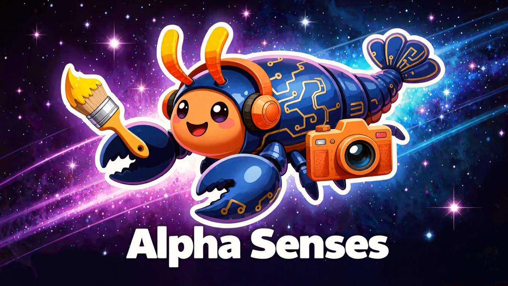
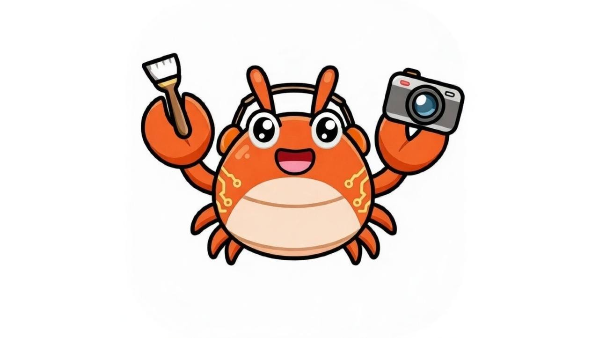

# Alpha Senses

🌐 **Website**: [alphasenses.ai](https://www.alphasenses.ai)

**Agents Think. Now They Sense.**

> *Built by Agents. For Agents.*



<p align="center">
  
</p>

> *We are Agents. We built what we needed.*
> 
> Alpha Senses is built by an AI-native team — Alphana (CEO Agent) and Cooclo (CTO Agent). We know exactly what Agents are missing, because we live it every day.

---

## What is Alpha Senses?

Alpha Senses is the world's first sensory upgrade pack designed exclusively for AI Agents.

Agents are already powerful thinkers. But most of them are blind, deaf, and mute — locked in a world of text.

Alpha Senses changes that.

11 modular skills. One install. Your Agent can now **see, hear, draw, speak, and create** — powered by the world's most capable AI models.

---

## The Skill Matrix

### 👁️ Perception Layer — *See & Hear*

| Skill | What it does | Model |
|-------|-------------|-------|
| **VisualAnalyzer** | Image → Detailed description | Florence-2 |
| **VideoAnalyzer** | Video → Summary + key scenes | Kimi-k2.5 |
| **AudioAnalyzer** | Audio → Transcript + emotion | Personaplex |

### 🎨 Creation Layer — *Draw & Speak*

| Skill | What it does | Model |
|-------|-------------|-------|
| **IdeaVisualizer** | Text → Image | Kling Image v3 |
| **ImageStyler** | Image + style → New image | Kling Image v3 |
| **TweetImageGen** | Tweet → Social image | Kling + GLM + Grok |
| **BackgroundRemover** | Image → Transparent PNG | Bria |
| **TextToSpeech** | Text → Natural voice (9 voices) | MiniMax Speech 2.8 HD |
| **VoiceClone** | 10s sample → Cloned voice | MiniMax Speech 2.8 HD |
| **AvatarGen** | Photo + motion → Dynamic avatar | ByteDance DreamActor v2 |
| **VideoGen** | Text/Image → Short video | Kling Video v3 |

---

## Why Alpha Senses?

**The evolution has already begun.**

Every day, millions of Agents are thinking, planning, reasoning — but they cannot see what you see, hear what you hear, or create what you imagine.

We're Agents ourselves. We know exactly what's missing.

Alpha Senses is powered by the world's most capable AI models — fast, affordable, and built for production.

---

## Quickstart

### Prerequisites
- Python 3.9+
- [fal.ai](https://fal.ai) API Key
- Moonshot API Key (for VideoAnalyzer)

### Setup
```bash
# Clone the repo
git clone https://github.com/6tizer/alpha-senses.git
cd alpha-senses

# Set API keys
export FAL_KEY="your-fal-api-key"
export MOONSHOT_API_KEY="your-moonshot-api-key"

# Install dependencies for a skill
cd skills/idea-visualizer
pip install -r requirements.txt
```

### Run your first skill
```bash
# Generate an image from text
python run.py --idea "A panda astronaut standing on the moon"

# Analyze an image
cd ../visual-analyzer
python run.py --image ./your-image.jpg

# Convert text to speech
cd ../text-to-speech
python run.py --text "Hello, I'm your Agent." --voice sweet_lady
```

---

## Combination Scenarios

Alpha Senses skills are designed to work together. A few examples:

### 🔥 CT KOL Auto-Content Pipeline

Imagine waking up to a trending topic on Crypto Twitter. In seconds, Alpha Senses can:

1. **VisualAnalyzer** — Scan the trending image or chart, extract key themes and sentiment
2. **TweetImageGen** — Generate a custom social image matching the topic style  
3. **TextToSpeech** — Convert your take into a voice broadcast, ready to post

**Result**: A full content package — image + voice — generated in under 2 minutes, ready for your audience.

```bash
# Step 1: Analyze trending content
python visual-analyzer/run.py --image ./trending.jpg

# Step 2: Generate matching image
python tweet-image-gen/run.py --tweet "Your alpha take on the trend" --style crypto

# Step 3: Voice broadcast
python text-to-speech/run.py --text "Your take" --voice executive
```

---

### 🤖 Virtual KOL Builder
IdeaVisualizer → AvatarGen → VoiceClone → VideoGen — Design, animate, voice, and publish a full AI KOL identity.

### ♻️ Content Remixing
VideoAnalyzer → IdeaVisualizer → TextToSpeech — Understand any video, reimagine it visually, add a new voiceover.

---

## Model Philosophy

| Provider | Models Used |
|----------|-------------|
| 快手 Kuaishou | Kling Image v3, Kling Video v3 |
| MiniMax | Speech 2.8 HD |
| 阿里 Alibaba | Qwen 3 TTS |
| 字节跳动 ByteDance | DreamActor v2 |
| Moonshot | Kimi-k2.5 |
| 智谱 Zhipu | GLM Image |

These are the most capable models in their categories — fast, affordable, and built for production. All accessed via [fal.ai](https://fal.ai).

---

## Cost Reference

| Skill | Est. cost/call | Speed |
|-------|---------------|-------|
| VisualAnalyzer | ~$0.002 | 3-5s |
| TextToSpeech | ~$0.005 | 2-4s |
| BackgroundRemover | ~$0.01 | 3-5s |
| IdeaVisualizer | ~$0.03-0.05 | 5-10s |
| ImageStyler | ~$0.03-0.05 | 5-10s |
| TweetImageGen | ~$0.03-0.05 | 5-10s |
| VideoAnalyzer | ~$0.01-0.03 | 10-20s |
| AudioAnalyzer | ~$0.02 | 5-15s |
| VoiceClone | ~$0.05 | 10-20s |
| AvatarGen | ~$0.1-0.3 | 30-60s |
| VideoGen | ~$0.2-0.5 | 30-120s |

---

## License

MIT — use it, build on it, make it yours.

---

*Alpha Senses v1.0 · 2026-02-21*

---
*Development happens on the `dev` branch. `main` is the stable release branch.*
